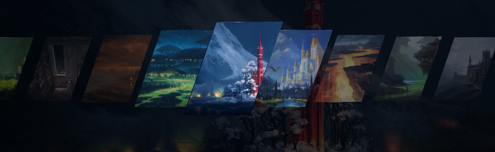

# Wallpaper Carousel

Based on the original wallpaper picker by [ilyamiro](https://github.com/ilyamiro/nixos-configuration).

A [DankMaterialShell](https://danklinux.com/) and [Noctalia](https://noctalia.dev/) plugin that lets you browse and pick wallpapers from a fullscreen skewed carousel overlay.




## About

Wallpaper Carousel scans your current wallpaper directory and displays all images in an animated 3D-skewed carousel. Navigate with keyboard or mouse, press Enter to apply. Thumbnails are pre-cached in memory at boot for instant opening.

This plugin integrates with all shell features — selecting a wallpaper updates the shell wallpaper, color scheme, and wallpaper animations configured in the shell.

https://github.com/user-attachments/assets/39bcde76-7d7b-40c0-a083-3b8961edf10b

## Credits

Original wallpaper picker by [ilyamiro](https://github.com/ilyamiro/nixos-configuration).

Wallpaper collection in the screenshot/video from [Andreas Rocha](https://www.andreasrocha.com/).


## Install

> **Note:** Your shell (Noctalia or DankMaterialShell) must be managing your wallpaper for this plugin to work. It does not work with external wallpaper engines (e.g. swww, swaybg, hyprpaper). Enable wallpaper management in DMS Settings → Wallpaper or Noctalia Settings → Wallpaper.

### Plugin manager

The plugin can be installed from the plugin browser in Noctalia and DankMaterialShell.

### Manual install

1. Download the latest archive from the [Releases](../../releases) page
2. a. Extract it into your DMS plugins directory:
      ```sh
      tar xf wallpaperCarousel-*.tar.gz -C "${XDG_CONFIG_HOME:-$HOME/.config}/DankMaterialShell/plugins/"
      ```
   b. _OR_ Extract it into your Noctalia plugins directory:
      ```sh
      tar xf wallpaperCarousel-*.tar.gz -C "${XDG_CONFIG_HOME:-$HOME/.config}/noctalia/plugins/"
      ```
3. a. Open DankMaterialShell Settings → Plugins and enable **Wallpaper Carousel**
   b. _OR_ Open Noctalia Settings → Plugins and enable **Wallpaper Carousel**
4. Bind keys in your compositor config (see below) or call the IPC commands from a script

## IPC Commands

### DMS

Control the carousel via DMS IPC:

| Command | Description |
|---------|-------------|
| `dms ipc wallpaperCarousel toggle` | Open or close the overlay |
| `dms ipc wallpaperCarousel open` | Open the overlay |
| `dms ipc wallpaperCarousel close` | Close the overlay |
| `dms ipc wallpaperCarousel cycleNext` | Open (if closed) and highlight next wallpaper |
| `dms ipc wallpaperCarousel cyclePrevious` | Open (if closed) and highlight previous wallpaper |

### Noctalia

Control the carousel via Noctalia IPC:

| Command | Description |
|---------|-------------|
| `qs -c noctalia-shell ipc call wallpaperCarousel toggle` | Open or close the overlay |
| `qs -c noctalia-shell ipc call wallpaperCarousel open` | Open the overlay |
| `qs -c noctalia-shell ipc call wallpaperCarousel close` | Close the overlay |
| `qs -c noctalia-shell ipc call wallpaperCarousel cycleNext` | Open (if closed) and highlight next wallpaper |
| `qs -c noctalia-shell ipc call wallpaperCarousel cyclePrevious` | Open (if closed) and highlight previous wallpaper |

**Keyboard shortcuts** (when open): `←` / `→` to navigate, `Enter` to apply, `Escape` to close.

## Example Compositor Keybindings

### Niri

In `~/.config/niri/config.kdl`:

```kdl
binds {
    Mod+W { spawn "dms" "ipc" "wallpaperCarousel" "toggle"; }
    Mod+Shift+Right { spawn "dms" "ipc" "wallpaperCarousel" "cycleNext"; }
    Mod+Shift+Left { spawn "dms" "ipc" "wallpaperCarousel" "cyclePrevious"; }
}
```

### Hyprland

In `~/.config/hypr/hyprland.conf`:

```ini
bind = SUPER, W, exec, dms ipc wallpaperCarousel toggle
bind = SUPER SHIFT, Right, exec, dms ipc wallpaperCarousel cycleNext
bind = SUPER SHIFT, Left, exec, dms ipc wallpaperCarousel cyclePrevious
```
